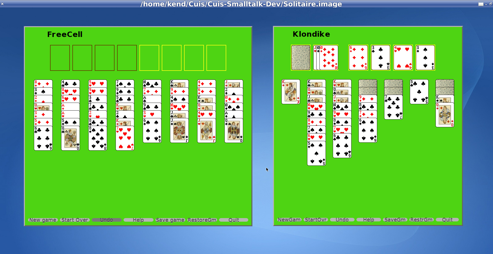

Cuis-Solitaire
==========
Tested with Cuis 4.2 rev 3319

Solitaire:  Klondike & FreeCell Solitaire Games

````Smalltalk
	Feature require: 'Morphic-Games-Solitaire'
````

Then execute

````Smalltalk
    Klondike newGame.
    FreeCell newGame.
````

Or use the World Menu to invoke:  New Morph > Games-Solitaire > FreeCell

You can also scale the card table to fit on your screen.
````Smalltalk
	FreeCell  newGameWithScale: 0.8.
	Klondike newGameWithScale: 0.8.

	FreeCell  newGameWithScale: 1.2.
	Klondike newGameWithScale: 1.2.
````


